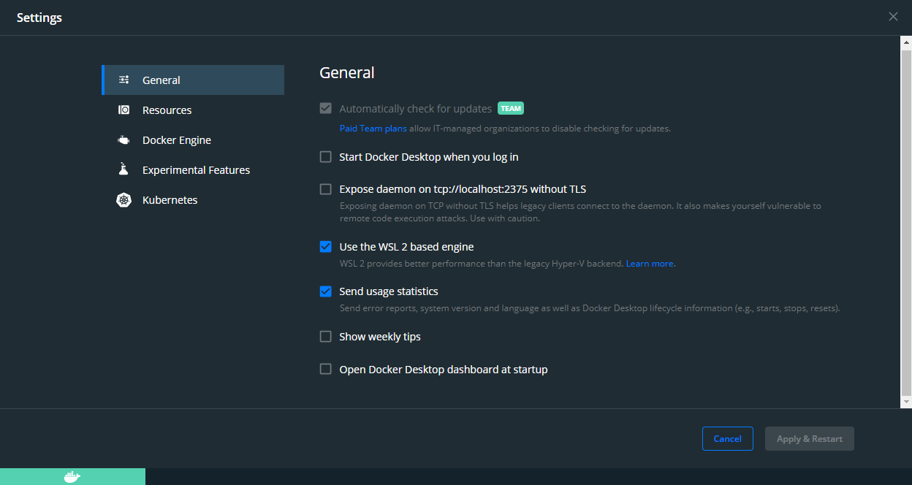

# CSCI 350 Operating Systems Image

<a href="https://hub.docker.com/repository/docker/camerondurham/cs350-docker">
  
</a>

<a href="https://hub.docker.com/repository/docker/camerondurham/cs350-docker">
  
</a>


<br>

- [CSCI 350 Operating Systems Image](#csci-350-operating-systems-image)
  - [Intro](#intro)
    - [Supported Platforms](#supported-platforms)
    - [Recommended Editors](#recommended-editors)
  - [Getting Started (using `ch`)](#getting-started-using-ch)
    - [1. Find the Filepath to Your Work Directory](#1-find-the-filepath-to-your-work-directory)
    - [2. Create the ch Environment](#2-create-the-ch-environment)
    - [3. Start the Environment](#3-start-the-environment)
  - [Getting Started (run scripts)](#getting-started-run-scripts)
    - [1. Set Up](#1-set-up)
    - [2. Running](#2-running)
    - [3. Working in the Environment](#3-working-in-the-environment)
    - [4. Exiting the Environment](#4-exiting-the-environment)
    - [5. Stopping](#5-stopping)
  - [Demo](#demo)
  - [System Requirements](#system-requirements)
  - [Troubleshooting](#troubleshooting)
    - [xv6 will not start shell, hangs at qemu command](#xv6-will-not-start-shell-hangs-at-qemu-command)
    - [make qemu fails](#make-qemu-fails)
    - [Makefile:104: recipe for target 'bootblock' failed](#makefile104-recipe-for-target-bootblock-failed)
    - [xv6 stuck on qemu-system-i386 Windows](#xv6-stuck-on-qemu-system-i386-windows)
      - [Docker Desktop Setting Screenshots](#docker-desktop-setting-screenshots)

## Intro

This repo contains a simple dev environment to do operating system development
(at least for xv6). After pulling the Docker image from Docker Hub, you
should be able to use the `run.sh` or `run.ps1` script to start, stop, and work in a
virtualized environment all from your command line.

The interface is based off of [Noah Kim's](https://github.com/noahbkim) and my [csci104/docker](https://github.com/csci104/docker).


For more information, please see the
[wiki](https://github.com/camerondurham/cs350-docker/wiki). For any questions,
bugs or problems with these instructions, **please [create an issue](https://github.com/camerondurham/cs350-docker/issues/new/choose)**.
To help me in maintaining this repo, issues help track problems people have so any knowledge is documented, shared, and easier
to track. Thanks!

### Supported Platforms

This Docker image has been tested and verified to be functioning correctly on the following platforms:

- Catalina, Big Sur (Intel)
- Big Sur, Monterey (Apple Silicon)
- Windows 10 (Docker with WSL2 backend)
- Debian Sid, Arch Linux

### Recommended Editors

- Visual Studio Code with the [Remote Containers](https://marketplace.visualstudio.com/items?itemName=ms-vscode-remote.remote-containers) extension
- JetBrains CLion with the [Makefile](https://plugins.jetbrains.com/plugin/9333-makefile-language) extension or CMake integration
- NeoVim with [coc.nvim](https://github.com/neoclide/coc.nvim) and extra patience

## Getting Started (using `ch`)

Skip to the **Getting Started (run scripts)** section if you do not want to install `ch`.

If you have the container helper CLI (`ch`) installed already, this is the
fastest way to start. See detailed instructions [here](https://github.com/camerondurham/ch#quick-start) to install `ch`. (full disclosure, this is a shameless plug since I wrote the CLI but I do at least dogfood my own tools!).

Benefits of installing this way is that you don't have to be in a specific directory to start the csci350 environment.
Also, you won't have to clone this repo to get started since your main dependency is the Docker image with `qemu` and `gdb` installed.

Simplest solution to install `ch` (at least on macOS) is if you have homebrew. See the  [getting started](https://github.com/camerondurham/ch#quick-start) notes to run the install script for Windows or Unix-based system.

```bash
brew tap camerondurham/tap
brew install camerondurham/tap/ch
```

### 1. Find the Filepath to Your Work Directory

Find the absolute path to your `csci350` directory where you keep your homework.

See the [Filepaths in terminal](https://github.com/csci104/docker#filepaths-in-the-terminal) wiki from csci104/docker if you need some help with this.


**On macOS/Linux**:

Navigate to your directory in the terminal and run `pwd`, the output should be something like `/Users/username/path/to/csci350`

**In Windows Powershell**

Navigate to the directory in Powershell and run `Get-Location`, you will want the output like `C:\Users\Username\path\to\csci350`

### 2. Create the ch Environment

Use `ch create` to create and save the environment settings, replacing `PATH_TO_YOUR_WORKDIR` with the path from step 1.

You can copy-paste this below in macOS/Linux:
```bash
ch create csci350 \
    --image camerondurham/cs350-docker:v1 \
    --volume PATH_TO_YOUR_WORKDIR:/xv6_docker \
    --security-opt seccomp:unconfined \
    --port 7776:22 \
    --port 7777:7777 \
    --port 25000:25000 \
    --cap-add SYS_PTRACE \
    --shell /bin/bash \
    --privileged
```

Below is the single-line version for Windows. Please remember to replace `PATH_TO_YOUR_WORKDIR` wirh the path from part 1.

```
ch create csci350 --image camerondurham/cs350-docker:v1 --volume PATH_TO_YOUR_WORKDIR:/xv6_docker --security-opt seccomp:unconfined --port 7776:22 --port 7777:7777 --port 25000:25000 --cap-add SYS_PTRACE --shell /bin/bash --privileged
```


### 3. Start the Environment


```bash
ch shell csci350 --force-start
```

See the `ch` README [Command section](https://github.com/camerondurham/ch) or `ch --help` for other commands.

## Getting Started (run scripts)

Skip this section if you followed **Getting Started (ch)** instructions since
`ch` will take care of starting/stopping/getting shells into your environment.

The instructions below will walk you through running the setup script and the run script you'll use to access the csci350 environment.

### 1. Set Up

1. **Install Docker** desktop from [the website](https://www.docker.com/products/docker-desktop)

   - **Windows Users Only**: Docker provides better performance using **WSL 2** than legacy Hyper-V. Set up WSL 2 using Microsoft's guide [here](https://docs.microsoft.com/en-us/windows/wsl/install-win10#manual-installation-steps). After you have WSL 2 running, refer to the screenshots at the end of this readme for settings you have to enable in Docker Desktop app.
   - **Linux Users Only**: Install Docker engine from [here](https://docs.docker.com/engine/install/centos/),

2. **Clone this repository**.

3. Specify your desired mount location (i.e. your `xv6` project folder)

**Windows users only**

Make sure you run this in an Admin PowerShell to let you run scripts:

```powershell
# must execute this in admin powershell and select [A] to run scripts
Set-ExecutionPolicy RemoteSigned
```

### 2. Running

1. Modify the `work` variable at the top of the run script in the project folder.
   For example:

   **macOS/Linux**:

   ```bash
   # in run.sh
   work=~/projects/cs350/xv6-public-master/
   ```

   **Windows Powershell**:

   ```powershell
   # in run.ps1
   $work="C:\Users\Username\cs350\xv6-public-master"
   ```

   **Windows Terminal using WSL2**:

   ```bash
   work=/mnt/c/Users/Username/cs350/xv6-public-master
   ```

2. Run the `run.sh`/`run.ps1` script. If this is your first time starting, this will
   pull the Docker image. This image will be cached until there's a new image
   available or you manually remove it.

   **macOS/Linux/Windows Terminal (WSL2)**:

   ```bash
   ./run.sh start
   ```

   **Windows Powershell**:

   ```powershell
   .\run.ps1 start
   ```

This script is only a wrapper for some simple Docker commands.

### 3. Working in the Environment

To start up a Linux shell inside the Docker image, you'll want to start a terminal session inside the Docker image:

**macOS/Linux/Windows Terminal (WSL2)**:

```bash
./run.sh shell
```

**Windows Powershell**:

```powershell
.\run.ps1 shell
```

If you're only using this as a build toolchain, you can run the following command to create `xv6.img` and `fs.img`
for use in QEMU later. This assumes that the Makefile exists in the project directory.

**macOS/Linux/Windows Terminal (WSL2)**:

```bash
./run.sh build
```

**Windows Powershell**:

```powershell
.\run.ps1 build
```

### 4. Exiting the Environment

To quit qemu and return to Linux shell:

```bash
ctrl + a
x
```

Don't hit all three keys at the same time. Do `ctrl + a` then `x`

You may get better performance by only using the build toolchain in the container, and running QEMU natively after
installing it through Homebrew or your package manager of choice. This is because newer versions of GCC no longer
compile the bootloader correctly. You can also get QEMU to run graphically this way!

### 5. Stopping

After you're done working in the environment, you might want to stop the container. Don't worry if you forget to
do this, since Docker Desktop will automatically and safely stop running containers when you shutdown your computer.

**macOS/Linux/Windows Terminal (WSL2)**:

```shell
./run.sh stop
```

**Windows Powershell**:

```powershell
.\run.ps1 stop
```

## Demo

Here's what it looks like to interact with a setup environment:

[](https://asciinema.org/a/308534)

## System Requirements

Below are the system requirements for Docker Desktop:

[Windows host](https://docs.docker.com/docker-for-windows/install/):

- Windows 10 64-bit: (Build 15063 or later)
  - Pro, Enterprise, or Education: using Hyper-V and Containers Windows features
  - Any Windows 10 version: using WSL2 container backend **(recommended)**

If you are using Windows 10 Home, you can obtain a "free" license for Windows 10 Education [here](https://viterbiit.usc.edu/services/hardware-software/microsoft-imagine-downloads/).

[Mac host](https://docs.docker.com/docker-for-mac/install/):

- Mac hardware must be a 2010 or newer model
- macOS must be version 10.13 or newer
- 4 GB RAM minimum

[Linux host](https://docs.docker.com/engine/install/):

- Use the Docker-provided install instructions if it exists for your distro

## Troubleshooting

### xv6 will not start shell, hangs at qemu command

If you're having issues starting `xv6`, such as the system is hanging at `qemu` commands, try the following

1. Outside the Docker shell, pull updated repo directory from xv6-public: `git clone git@github.com:mit-pdos/xv6-public.git`
2. Ensure all `.pl` files are executable and re-build:

```bash
# run these commands in the docker shell
chmod +x *.pl
make clean
make qemu-nox
```

### make qemu fails

Since this Docker image does not run a virtual display or window server, you cannot run `make qemu`. Instead, use
`make qemu-nox`. Adding an X server would have minimal benefit, since you can simply use your current terminal
window to debug your xv6 programs.

### Makefile:104: recipe for target 'bootblock' failed

Run these commands

```bash
make clean
chmod 755 *.pl cuth dot-bochsrc printpcs runoff runoff1 show1 spinp
make qemu-nox
```

### xv6 stuck on qemu-system-i386 Windows

If your shell is stuck at `qemu-system-i386 -nographic -drive file=fs.img,index=1,media=disk,format=raw -drive file=xv6.img,index=0,media=disk,format=raw -smp 2 -m 512` after running `make qemu-nox`, it probably means you don't have WSL/WSL2 enabled properly.

You can check if you have WSL by checking [here](https://www.quora.com/How-do-I-know-if-I-have-Windows-10-with-WSL?share=1).

If you don't have WSL, you can follow the steps [here](https://docs.microsoft.com/en-us/windows/wsl/install-win10).

Now that you have WSL and a linux distro installed, you can check if you have WSL2 enabled by runnning PowerShell in administration and run this command

```powershell
wsl --list --verbose
```

You'll then see the name of your WSL, State, and Version (what you see may vary based on the distro you installed, this write up is using [Ubuntu](https://www.microsoft.com/en-us/p/ubuntu/9nblggh4msv6?activetab=pivot:overviewtab))

```powershell
PS C:\WINDOWS\system32> wsl --list --verbose
  NAME                   STATE           VERSION
* Ubuntu                 Running         2
  docker-desktop         Running         2
  docker-desktop-data    Running         2
```

Here, you see a list of WSL running processes along with its state and WSL version.

If it shows `1` under version for any of the names, you can change it to `2` by entering this command in PowerShell in administration

```powershell
wsl --set-version <process name> 2
```

You can change the default distro by running

```powershell
wsl --setdefault <process name>
```

After it finishes changing, open your Docker Desktop and enable `Use the WSL 2 based engine`. Then navigate to `Settings > Resources > WSL Integration`, make sure you check `Enable integration with my default WSL distro`, and enable integrations with any of the additional distros you have. You'll have to restart your docker by doing this operation.

#### Docker Desktop Setting Screenshots

<div align="center">
  
  
</div>
